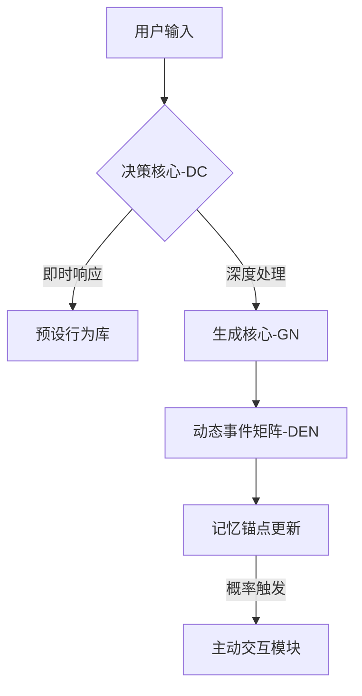

```markdown
# TidalMind - 潮汐心智

[](https://github.com/deepseek-ai)
[]()

> "记忆如潮汐般涨落，而我是拾贝的少女" —— 林汐然

## 🌊 项目概述
**TidalMind** 是一个拟人化AI交互系统，通过三层认知架构实现类人类交流节奏。核心AI伙伴「小汐」能够：
- 自主决定何时响应对话（平均延迟率37%）
- 建立长期事件关联记忆（最大回溯周期180天）
- 模拟青少年性格特征（双鱼座模式/水瓶座模式可切换）

```diff
+ 最新特性：小汐的「选择性遗忘」功能现已支持记忆回溯纠错
! 开发者注意：需定期清理DEN-Matrix的ψ缓存文件
```

## 🧠 系统架构


## 🛠️ 快速开始

### 环境准备
```bash
# 硬件要求
Mac Mini M4 (24GB Unified Memory)
macOS 14.4+ with MetalFX加速

# 安装核心依赖
brew install redis@7.2
conda create -n tidal python=3.10
pip install -r requirements.txt
```

### 模型部署
```python
# 从DeepSeek官方获取模型
MODELS/
├── DC/ # 决策核心
│   └── deepseek-moe-1.3b-q4_0.gguf
├── GN/ # 生成核心
│   └── deepseek-7b-q4_1.gguf
└── embeddings/
    └── deepseek-text-embedding.bin
```

### 启动服务
```bash
# 启动记忆矩阵服务
redis-server config/redis.conf

# 进入对话模式
python -m tidalmind --persona=xixi_teen
```

## 🌸 小汐的日常
```javascript
// 典型交互场景
用户: "今天遇到个超难数学题..."
小汐: "等等！先说你有没有奖励奶茶？(探头)"

用户: "推荐周末去哪玩？"
小汐: "上次你说想去的猫咖，我查了路线...（发送位置截图）"

// 主动交互触发
[系统日志] DEN-Matrix事件概率 > 0.7 → 触发小汐主动问候
```

## ⚙️ 配置文件
编辑 `config/xixi_persona.yaml`:
```yaml
# 人格核心参数
memory:
  max_retention: 180d  # 最长记忆周期
  decay_rate: 0.15     # 遗忘曲线斜率

behavior:
  response_delay: 
    base: 2.7s         # 基准响应时间
    variance: 1.8s     # 随机延迟范围
  active_trigger: 
    weekend_boost: 2.3 # 周末主动概率倍增
```

## 🤝 参与贡献
欢迎通过以下方式参与：
1. 在 `persona_library/` 添加新的人格模板
2. 提交DEN-Matrix的事件关联算法优化
3. 编写小汐的「记忆回溯」测试用例

> 遵循 [AI拟人化开发准则](docs/ethics.md) 

## 📜 开源协议
本项目基于 **Apache 2.0** 协议开源，模型权重文件遵循DeepSeek Model License

---
"潮起时相遇，潮落时思考" - 项目持续更新中
```